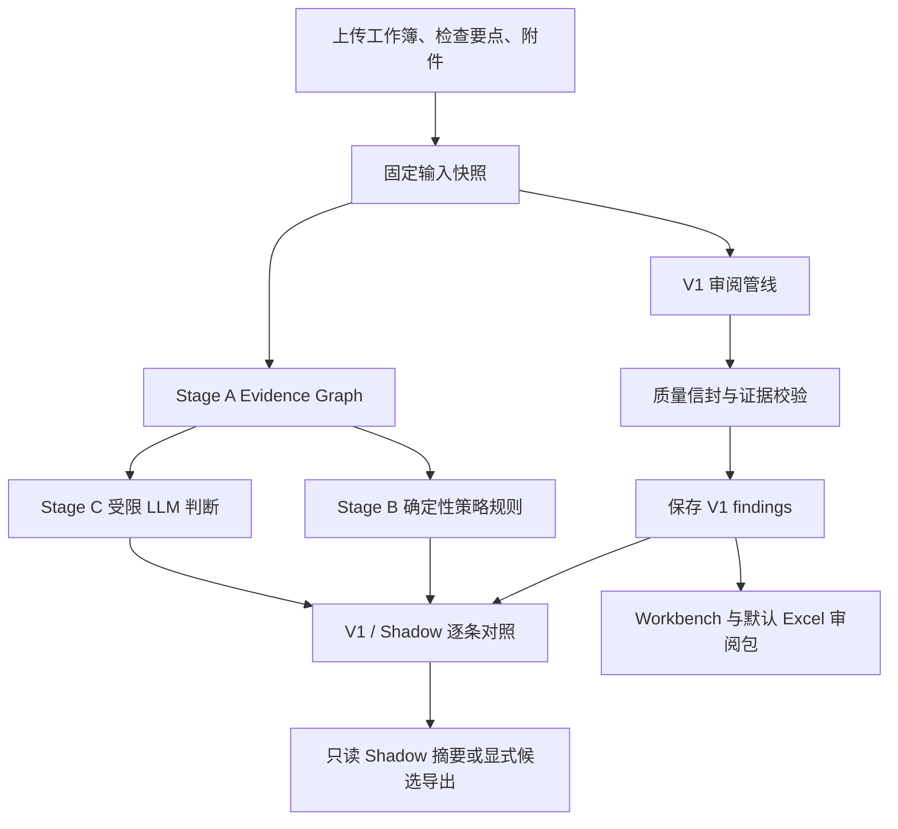

# 项目结构说明

- 后端（FastAPI）：`src/`
- 前端（Next.js）：`frontend/`

# 本地运行（后端）

## 运行流程

```bash
bash scripts/local_run.sh -m flow
```

## 运行节点

```bash
bash scripts/local_run.sh -m node -n node_name
```

## 启动 HTTP 服务

```bash
bash scripts/http_run.sh -p 5000
```

## 本地配置 LLM

后端使用 OpenAI-compatible 接口。Agent 对话和 Excel 审阅共用同一个 API key/base URL，但可以通过两个模型变量分别指定模型。

```bash
cp .env.example .env
# 编辑 .env，至少填写 LLM_API_KEY、LLM_BASE_URL，
# 并将 AGENT_LLM_MODEL、REVIEW_LLM_MODEL 改成服务商实际可用的模型名
```

`LLM_BASE_URL` 填服务商的 API 根地址（通常以 `/v1` 结尾），不要填写具体的 `/chat/completions` 路径。启动方式会自动读取项目根目录的 `.env`：

```bash
bash scripts/http_run.sh -p 5000
# 或
bash scripts/local_run.sh -m flow
```

完整变量示例见 [.env.example](/Users/vyang/Desktop/spaces/audit-workpaper-agent/.env.example)。

## 审阅逻辑与阶段说明

系统把“当前可交付的审阅结论”和“用于验证、比较的候选结果”分开处理。核心原则是：

- **V1 是当前权威结论**：保留现有审阅逻辑和结果字段，兼容已有 JSON、Excel 首表和调用方。
- **质量信封是增量信息**：为每条 finding 补充证据校验、复核状态、来源 hash、根因分组和整改状态，不用空字段表示“已通过”。
- **Evidence-First 阶段默认是 Shadow**：阶段 B/C 可以产生候选结果，但不能静默覆盖 V1；只有显式请求才允许导出 Stage C 候选。
- **证据先于结论**：引用必须能够在本次审阅冻结的工作簿、附件索引或 Evidence Graph 中按定位、摘录和 hash 复现；无法复现的引用会被拒绝或使结论进入 `unknown`。

### 端到端流程



### 阶段 0：输入与冻结快照

审阅开始后先生成 `review_id`，把工作簿、检查要点、附件目录或附件预览固定到
`assets/reviews/<review_id>/inputs/`。后续 V1、Evidence Graph、附件索引和 Shadow
结果都应基于这份快照，而不是基于可能被替换的上传目录。

快照同时记录输入文件名、大小和 SHA256；服务端对外只展示相对文件名、opaque ID 或 hash，
不展示服务器绝对路径。快照失败会记录 artifact 错误，但不会把一个已经完成的 V1 结果
伪装成 Stage A 已完成。

### 阶段 1：V1 审阅管线（当前权威）

V1 负责生成用户当前看到的发现。每个目标 Sheet 会按可用输入执行以下检查：

1. 读取检查要点并进行 checkpoint 审阅。
2. 匹配工作簿中的附件引用，必要时使用受限证据 Agent 查找快照内的证据文件。
3. 检查“执行证据 ↔ 审计步骤”、程序配对、Sheet 范围和 A-C 对应关系。
4. 对规则产生的 finding 做模型复核；对 P0 或明确升级项执行对抗式挑战。
5. 对 `fail` / `unknown` 运行确定性交叉校验（由 `REVIEW_DETERMINISTIC_CROSSCHECK_MODE` 控制）。

V1 输出仍保存到 `assets/results/<review_id>_findings.json`，并通过
`GET /findings/{review_id}` 返回。V1 的 `total_findings` 是原始发现数，不会因为重复标记
而被静默删除或改写。

### 阶段 1.5：质量信封与证据验证

V1 finding 保存前，系统会在冻结输入上附加 `quality`：

| 质量信息 | 含义 |
| --- | --- |
| `finding_id` | 基于输入 hash、问题类型、定位、状态和证据身份生成的稳定 ID |
| `primary_location` | 优先使用已验证的 Sheet/单元格；没有单元格时明确标记附件或未定位 |
| `citation_validation` | `verified`、`partial`、`invalid` 或 `not_available`，并记录拒绝原因 |
| `claim_support` | 已验证证据是否支持该 assertion/claim；附件型 fail 结论必须有受控支持 |
| `consistency` | 同一执行内受控 claim 是否冲突；`conflicted` 是可发布结论的阻断信号 |
| `gates` | 每个复核步骤的 `passed`、`flagged`、`not_run` 或 `error` |
| `provenance` | 输入 SHA256、引擎版本和策略包版本 |
| `grouping` | 根因编号、严格重复关系和相关 finding ID |
| `remediation` | 整改动作、所需证据、验收条件和待人工补全字段 |

附件引用只有同时满足“来源属于该 Sheet 的审阅范围”“冻结文本中逐字且唯一命中”“文件
hash/文本 hash/偏移可复现”时，才会进入已验证引用。歧义、越界或内容变更的引用不会
出现在证据溯源表中。

`REVIEW_RESULT_QUALITY_MODE` 控制质量信封：

- `shadow`（默认）：写入质量信息，但保持 V1 原结论和兼容字段不变。
- `on`：在证据无法验证时执行 fail-closed 降级，并保留原建议严重级别与降级原因。
- `off`：关闭新增质量信封，回到历史 payload 形态。

质量捕获本身失败时，系统会保存 V1，并在质量统计中记录错误；质量元数据不能阻断已完成
的 V1 审阅。

### 阶段 A：Evidence Graph（Shadow 基础层）

阶段 A 从固定工作簿生成受边界约束的 Evidence Graph：Sheet、单元格坐标、单元格内容
hash、证据 ID、输入 SHA256，以及附件索引和来源范围。它回答的是“本次审阅到底看到了
哪一份冻结事实”，不直接替换 V1 finding。

阶段 A artifact 通常包含：

- `manifest.json`：审阅输入、目标 Sheet、引擎版本和 artifact 状态；
- `evidence.json`：受限的工作簿事实和捕获统计；
- `inputs/`：本次审阅所使用的固定输入快照。

如果输入快照、证据图或附件目录发生错误，artifact 会标记为 `error`，但不会从 V1
结果推断一个“看似完成”的 Shadow 证据链。

## 阶段 B 策略包试点

审阅完成后，后端会在 `assets/reviews/<review_id>/` 中异步生成 Evidence-First shadow artifact。阶段 B 默认使用仓库内版本化的 `itgc-core/1.0.0` 策略包执行三条确定性规则，并写入：

- `review-plan.json`：本次实际匹配的 Sheet、事实、规则和证据 ID；显式指定但不存在的 Sheet 会记录 `scope_validation_failed`，不会回退到全部 Sheet。
- `policy-findings.json`：带规则版本、稳定 `identity_key`、`evidence_id`、逐字引用、偏移和内容哈希的阶段 B 候选。

试点规则包括“仅访谈且缺少实质性证据”“标准要求的证据类型未在执行描述中体现”和“特权账号范围未覆盖 OS/DB 管理员”。这些结果暂不合并到 `findings.json` 或现有 `/findings/{review_id}` 响应，V1 结果仍是用户侧权威结果。

相关配置：`REVIEW_POLICY_MODE=shadow|off`（默认 `shadow`）、`REVIEW_POLICY_PACK_ID`、`REVIEW_POLICY_PACK_VERSION`、`REVIEW_POLICY_PACK_ROOT` 和可选的 `REVIEW_ENGINE_VERSION`。策略包加载或执行失败只会将 shadow artifact 标记为 error，不会回滚或修改已完成的 V1 审阅。

## 阶段 C 受限判断试点

阶段 C 在阶段 B 的 Evidence Graph 和附件快照之上增加两类受限 LLM 判断：证据文件是否与执行步骤对应，以及实际执行程序是否满足标准程序的控制意图。它使用独立、版本化的 `itgc-judgement/1.0.0` 策略包；每个请求只携带目标控制事实和已固定的证据片段，不把整张 Sheet 或任意目录交给模型。

阶段 C 默认关闭。设置 `REVIEW_JUDGEMENT_MODE=shadow` 后，审阅会在 V1 和阶段 B shadow artifact 完成后，额外写入：

- `judgements.json`：请求、模型原始结果、逐条引用校验状态和执行统计。
- `v2-findings.json`：V2 Finding、稳定身份、`supported|contradicted|insufficient` 决策、精确证据引用，以及 V1 兼容投影。

服务端只接受请求白名单内的证据 ID、合法偏移、逐字摘录和匹配的内容哈希；校验失败或证据不足会落为 `unknown`，不会用模型自行生成的路径或摘录补证。阶段 C 失败只会把 shadow artifact 标记为 error，既不会覆盖 `findings.json`，也不会改变现有 V1 `/findings/{review_id}` 响应。启用该模式会消耗 `REVIEW_LLM_MODEL` 对应的 LLM 额度，并受 `REVIEW_JUDGEMENT_MAX_REQUESTS` 限制。

相关配置：`REVIEW_JUDGEMENT_MODE=shadow|off`（默认 `off`）、`REVIEW_JUDGEMENT_PACK_ID`、`REVIEW_JUDGEMENT_PACK_VERSION`、可选的 `REVIEW_JUDGEMENT_PACK_ROOT` 和 `REVIEW_JUDGEMENT_MAX_REQUESTS`。未设置 `REVIEW_JUDGEMENT_PACK_ROOT` 时，会复用 `REVIEW_POLICY_PACK_ROOT`，再回退到仓库内 `policy_packs/`。

## V1 / Shadow 对照与候选边界

Stage C 产物完成后，系统会把 V1 finding 与 V2 finding 做逐条、可复现的精确对照。配对
只使用稳定结构化身份、Sheet/定位、状态和证据 ID，不使用自由文本相似度。差异分类包括：

- `agreement`：状态和证据身份一致；
- `legacy_only`：只有 V1 有该发现；
- `shadow_only`：只有 Shadow 有该发现；
- `status_conflict`：同一结构化身份的状态不同；
- `evidence_conflict`：状态相同但证据身份不同；
- `not_comparable`：身份缺失或出现歧义，系统拒绝猜测配对。

对照摘要保存在 `comparison.json`，工作台只显示受限的 ID、状态和计数。它的明确语义是
“候选差异，尚未成为权威结论”。

导出规则如下：

| 请求 | 使用的来源 | 结果 |
| --- | --- | --- |
| `/findings/{review_id}/export?format=xlsx` | V1 | 默认、兼容的审阅包 |
| `...&source=legacy` | V1 | 与默认行为相同 |
| `...&source=stage_c_shadow` | Stage C | 只有 artifact 已完成时才导出候选；缺失或未完成返回 `409` |
| 未知 `source` | V1 | 安全回退到 legacy，不隐式选择 V2 |

Stage B/C 的任何异常只会影响 Shadow artifact 状态。只要 V1 已完成，用户仍可查看 V1
结果、导出默认审阅包并在稍后检查 Shadow 错误。

## Workbench 中查看阶段结果

审阅结果页会在 V1 结果返回后继续轮询 `GET /review/{review_id}/artifact`，并在“Evidence-First 过程”面板中展示：阶段 A 的输入快照、阶段 B 的规则候选、阶段 C 的受限判断，以及每条候选对应的 Sheet/单元格和逐字证据摘录。阶段面板是只读 shadow 视图，不会替换 V1 结果；阶段 C 未配置时会明确显示“未启用”。

V1 finding 卡片和 Excel 审阅包还会显示质量信封：引用是否已验证、主定位、每个复核 gate 是否实际执行、根因/重复关系、整改缺口和输入 hash 前缀。质量信封存在时，工作台只展示已验证引用，不把被拒绝的附件引用当作证据。阶段 C 完成后，Evidence-First 面板会显示 V1/Shadow 逐条对照；其中 Shadow 差异明确标记为候选，不是当前权威结论。

默认导出仍为 V1：`GET /findings/{review_id}/export?format=xlsx`。只有显式请求 `source=stage_c_shadow` 才会导出 Stage C 候选；候选 artifact 缺失或尚未完成时返回 `409`，不会从 V1 猜测候选结果。

工具返回值同时提供 `artifact_url`，便于 CLI 或其他客户端读取同一份受限视图。

## 审阅结果质量评估

`evaluation_sets/review-quality/` 保存质量评估 schema 和合成样例；客户底稿、OCR
全文和绝对路径必须留在批准的受控存储中。评估器只消费按 `case_id` 分组的 findings
JSON，不读取工作簿，也不调用 LLM：

```bash
uv run python scripts/evaluate_review_quality.py \
  --manifest /path/to/manifest.json \
  --results /path/to/results-by-case.json
```

旧版平铺 `{case_id: [...]}` 输入仍会计算基线 finding / citation 指标，但永远不能
`promotion_ready`。用于推广的 `review-quality/2` 输入必须同时提供 V1、V2 及同一
execution identity 下至少五次的重复运行：

```json
{
  "v1": {"case-id": []},
  "v2": {"case-id": []},
  "repeated_runs": {"case-id": [[], [], [], [], []]}
}
```

这里的 `v2` 指带 `review-quality/2` 质量信封的 V1 兼容 finding 集（例如 quality-on
受控重跑），不是原始 `stage-c-v2-findings/1` 候选 artifact；Stage C 仍只作为 shadow
差异和 SME 审阅材料。

每个 V2 case 都绑定 `input_sha256`、`input_set_sha256`、`execution_sha256`、受控
assertion / claim subject / scope identity、允许 evidence IDs、冲突/去重/整改预期。
不同 input-set / execution SHA、混合运行或无法证明为空结果来自同一运行条件时都会失败；不会
按 issue title、finding ID 或自由文本猜测配对。

报告的 `metric_details` 会显示每项指标的分子、分母、阈值、适用状态和失败 case。
技术门禁包括语义稳定性 ≥ 0.90、状态一致性 ≥ 0.95、V1 与候选引用复现均为 100%、附件型
可发布 fail 全部 `supported`、内部冲突率和误合并数为 0、P0/P1 整改完整率 100%，以及 V2
P0/P1 precision 不低于 V1。样本还必须至少有 6 份经裁决的底稿和 60 条经裁决 finding。

缺少人工裁决或任一质量门禁失败时，命令返回非零状态。`promotion_ready=true` 只是
单批技术条件已满足：仍需两个独立批次全部通过，并经审计 SME 审阅 V1/V2 差异后，才可
申请 `REVIEW_RESULT_QUALITY_MODE=on` 小流量试点。详细的采集、审批、canary 与回滚步骤见
[`docs/runbooks/review-quality-stability-promotion.md`](docs/runbooks/review-quality-stability-promotion.md)。

回滚时恢复 `REVIEW_RESULT_QUALITY_MODE=shadow` 和 `REVIEW_JUDGEMENT_MODE=off`，保持
默认 `source=legacy` 导出，并保留 `assets/reviews/<review_id>/` 的冻结 artifact 和失败
样本供差异分析，不能删除它们来重置质量记录。

# Docker 部署（后端）

## 构建镜像

```bash
docker build -t audit-workpaper-agent .
```

## 运行容器

```bash
# 提前创建挂载目录（避免容器内目录被遮盖）
mkdir -p logs assets/uploads

docker run -d \
  --name audit-agent \
  -p 5000:5000 \
  -e LLM_API_KEY=<your-api-key> \
  -e LLM_BASE_URL=<your-llm-base-url> \
  -e FRONTEND_ORIGINS=http://localhost:3000 \
  -v $(pwd)/logs:/app/logs \
  -v $(pwd)/assets/uploads:/app/assets/uploads \
  audit-workpaper-agent
```

## 安全更新自动合并

仓库已配置 dependabot（`.github/dependabot.yml`）+ CI（`.github/workflows/ci.yml`）。dependabot 每周一检查前后端依赖安全更新，开 PR 后 CI 跑测试，通过则自动 squash 合并。

**首次启用需在 GitHub 仓库设置（一次性，手动）**：

1. Settings → General → Pull Requests → 勾选 "Allow auto-merge"，默认合并方式选 **Squash**。
2. Settings → Branches → `main` → Add branch protection rule → 勾 "Require status checks to pass before merging" → required status checks 选 `backend` 和 `frontend`（CI job 名）。
3. Settings → Code security → 确认 "Dependabot security updates" 已开启。

完成上述设置后，dependabot 开的安全更新 PR 在 CI 通过后会自动合并到 `main`。major 更新单独成 PR，CI 因 breaking 失败则停住等人工处理。

## 环境变量

| 变量 | 必填 | 说明 |
|---|---|---|
| `LLM_API_KEY` | 是 | LLM API 密钥 |
| `LLM_BASE_URL` | 是 | LLM 接口地址 |
| `FRONTEND_ORIGINS` | 否 | CORS 允许的前端 Origin，默认 `http://localhost:3000` |
| `WORKSPACE_PATH` | 否 | 工作目录根路径，默认 `/app` |
| `APP_ENV` | 否 | 设为 `DEV` 开启开发模式（热重载） |
| `AGENT_LLM_MODEL` | 否 | Agent LLM 模型，默认 `doubao-seed-2-0-pro-260215` |
| `AGENT_LLM_TEMPERATURE` | 否 | Agent LLM 温度，默认 `0.7` |
| `AGENT_LLM_MAX_TOKENS` | 否 | Agent LLM 最大 token 数，默认 `10000` |
| `AGENT_LLM_TIMEOUT` | 否 | Agent LLM 超时（秒），默认 `600` |
| `REVIEW_LLM_MODEL` | 否 | 审阅引擎 LLM 模型，默认 `doubao-seed-1-6-251015` |
| `REVIEW_RESULT_QUALITY_MODE` | 否 | 结果质量信封：`shadow`（默认，仅记录）/`on`（对无证据失败降级）/`off` |
| `REVIEW_DETERMINISTIC_CROSSCHECK_MODE` | 否 | 确定性交叉校验：`all_findings`（默认）、`p0_only`、`off` |
| `REVIEW_EVIDENCE_AGENT_MODE` | 否 | 受限证据调查 Agent：`off`、`fallback`、`always`；默认 `fallback` |
| `REVIEW_EVIDENCE_AGENT_MAX_STEPS` | 否 | 单个 Sheet 的证据调查最大 Agent 步数，默认 `8` |
| `REVIEW_POLICY_MODE` | 否 | 阶段 B 策略 shadow：`shadow` 或 `off`；默认 `shadow` |
| `REVIEW_POLICY_PACK_ID` | 否 | 策略包 ID，默认 `itgc-core` |
| `REVIEW_POLICY_PACK_VERSION` | 否 | 策略包版本，默认 `1.0.0` |
| `REVIEW_POLICY_PACK_ROOT` | 否 | 策略包根目录；不设置时使用仓库内 `policy_packs/` |
| `REVIEW_ENGINE_VERSION` | 否 | artifact 中记录的执行器版本，默认 `stage-b-policy-shadow` |
| `REVIEW_JUDGEMENT_MODE` | 否 | 阶段 C 受限 LLM 判断：`shadow` 或 `off`；默认 `off` |
| `REVIEW_JUDGEMENT_PACK_ID` | 否 | 阶段 C 判断策略包 ID，默认 `itgc-judgement` |
| `REVIEW_JUDGEMENT_PACK_VERSION` | 否 | 阶段 C 判断策略包版本，默认 `1.0.0` |
| `REVIEW_JUDGEMENT_PACK_ROOT` | 否 | 阶段 C 判断策略包根目录；未设置时复用 `REVIEW_POLICY_PACK_ROOT` 或仓库内 `policy_packs/` |
| `REVIEW_JUDGEMENT_MAX_REQUESTS` | 否 | 单次审阅最多执行的阶段 C 判断请求数，默认 `200` |
| `MINERU_OCR_MODE` | 否 | OCR 模式：`off`（默认）、`auto`、`lightweight`、`precise`；远程处理附件前需明确开启 |
| `MINERU_TOKEN` | `precise/auto` 时 | MinerU 精确解析 API Token；`auto` 有 Token 时优先走精确 API |
| `MINERU_MODEL_VERSION` | 否 | 精确 API 模型，默认 `vlm` |
| `MINERU_OCR_LANGUAGE` | 否 | OCR 语言，默认 `ch` |
| `MINERU_OCR_MAX_WAIT_SECONDS` | 否 | 单个 OCR 任务最长等待时间，默认 `300` 秒 |
| `MINERU_OCR_POLL_INTERVAL_SECONDS` | 否 | OCR 轮询间隔，默认 `2` 秒 |
| `MINERU_OCR_MAX_TEXT_CHARS` | 否 | 单个附件纳入证据上下文的 OCR 文本上限，默认 `12000` |
| `S3_ENDPOINT_URL` | 否 | S3 兼容存储端点（启用对象存储时必填） |
| `S3_BUCKET_NAME` | 否 | S3 桶名 |
| `S3_STORAGE_TOKEN` | 否 | S3 代理签名 token |
| `PGDATABASE_URL` | 否 | PostgreSQL 连接串，不设置则使用内存存储 |

## 后端环境变量（本地开发）

- `FRONTEND_ORIGINS`：CORS 允许的前端 Origin 列表，使用英文逗号分隔；未设置时默认 `http://localhost:3000`
  - 示例：`FRONTEND_ORIGINS=http://localhost:3000,http://127.0.0.1:3000`
  - 若前端开发端口或域名有变化，需要同步更新该值
- `WORKSPACE_PATH`：工作目录根路径（影响上传文件落盘位置）；未设置时默认当前工作目录

## 上传接口（后端）

- Method：`POST`
- Path：`/upload`
- Content-Type：`multipart/form-data`
- 普通文件参数：`files`（可重复传多个文件）
- 附件目录参数：`upload_mode=attachments_dir`、`files`、与文件一一对应的 `relative_paths`
- 普通文件限制：最多 10 个文件；单文件最大 100MB
- 附件目录限制：最多 500 个文件；单文件最大 100MB；目录总大小最大 1GB

示例：

```bash
curl -X POST "http://localhost:5000/upload" \
  -F "files=@/path/to/a.pdf" \
  -F "files=@/path/to/b.png"
```

附件目录上传示例（每个 `relative_paths` 与同位置的 `files` 对应）：

```bash
curl -X POST "http://localhost:5000/upload" \
  -F "upload_mode=attachments_dir" \
  -F "relative_paths=SA-4c/evidence.txt" \
  -F "files=@/path/to/attachments/evidence.txt"
```

响应示例：

```json
{
  "files": [
    {
      "original_name": "a.pdf",
      "path": "assets/uploads/<uuid>_a.pdf",
      "size": 123
    }
  ]
}
```

落盘位置：

- `${WORKSPACE_PATH}/assets/uploads/`
- 附件目录落盘到 `${WORKSPACE_PATH}/assets/uploads/attachments/<batch-id>/`，并保留目录层级
- 返回的 `path` 为相对路径（从 `assets/` 起）
- 前端默认通过 `POST /api/upload` 代理到后端 `POST /upload`（读取 `NEXT_PUBLIC_BACKEND_URL`）

前端的“上传附件目录”会自动发送 `upload_mode=attachments_dir`。审阅 Agent 收到返回的
`directory` 路径后，将其作为 `review_workpaper(..., attachments_dir=...)`；审阅器会递归定位底稿引用的实际证据文件，并读取可解析文本参与分析。

审阅器默认采用“确定性索引 + 受限证据 Agent + 规则/LLM 校验”的混合方式：先快照目录并建立索引；只有附件引用未匹配、文件无法解析或需要进一步交叉查找时，才启动证据 Agent。该 Agent 只能列出、搜索和读取快照内已索引的相对路径，不能执行命令、写文件或访问其他目录。Agent 返回的路径和摘录会经过服务端校验，调查状态、工具调用、来源和未解决事项会写入审阅统计。

### OCR 附件证据

当 `MINERU_OCR_MODE` 不是 `off` 时，受限证据 Agent 会额外获得 `ocr_attachment` 工具。它只能对当前审阅快照中已索引的相对路径调用 MinerU，适用于图片、扫描 PDF 及其他普通解析器无法读取的支持格式；OCR 结果会回到同一个 `ocr_by_path` 缓存，再经过路径和逐字摘录校验后进入审阅上下文。

- `auto`：配置 `MINERU_TOKEN` 时走精确 API（本地签名上传、批量结果轮询、ZIP 中的 `full.md`）；未配置 Token 时走免 Token 的轻量文件上传 API。
- `lightweight`：免 Token，单文件、10MB/20 页限制，仅返回 Markdown；适合低敏感、较小的图片或扫描件，但受 IP 限频影响。
- `precise`：需要 `MINERU_TOKEN`，单文件支持至 200MB/200 页，返回 ZIP 结果并读取 `full.md`；更适合正式审阅。
- 默认关闭是为了避免审计附件未经批准被发送到外部服务。OCR 失败、超限或不支持时只记录 `unresolved`，不会把模型猜测当作证据。

接口实现依据 [MinerU 文档解析接口文档](https://mineru.net/apiManage/docs) 的签名上传、异步轮询和两种 API 模式。

# 前端运行（frontend/）

1. 进入前端目录：

```bash
cd frontend
```

2. 配置环境变量（推荐复制示例文件）：

```bash
cp .env.example .env.local
```

其中：

- `NEXT_PUBLIC_BACKEND_URL`：后端 FastAPI 服务地址（默认 `http://localhost:5000`）

3. 安装依赖并启动开发服务器：

```bash
npm install
npm run dev
```

默认访问地址：`http://localhost:3000`
